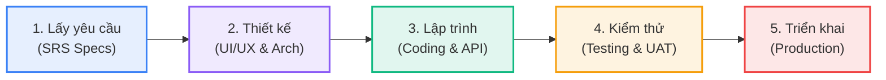
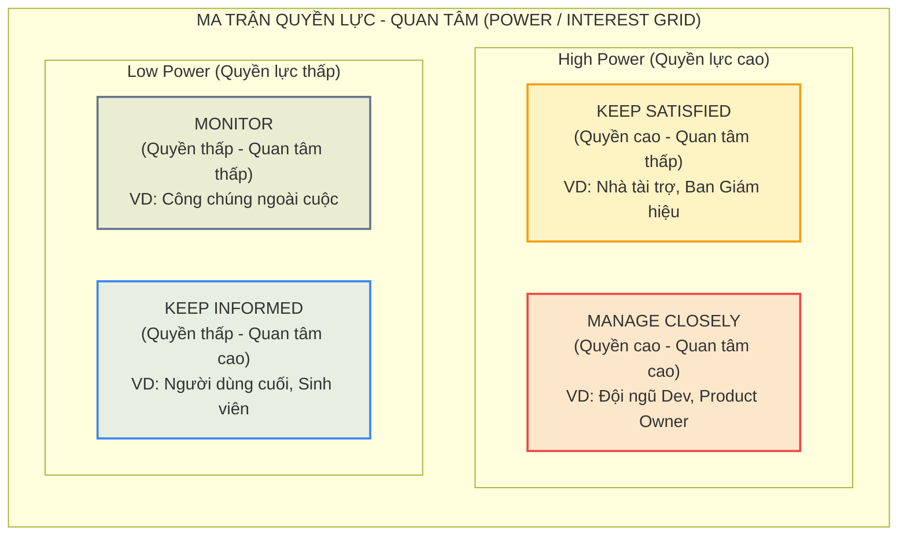

# TỔNG HỢP KIẾN THỨC PMG201c - BUỔI 1

---

## I. TỔNG QUAN VỀ DỰ ÁN CÔNG NGHỆ THÔNG TIN (IT)

### 1. Phân loại cấu thành hệ thống IT

- **Phần cứng (Hardware):** Thiết bị vật lý có thể chạm vào (máy chủ/server, thiết bị di động, chip, vi mạch...).
- **Phần mềm (Software):** Tập hợp các chương trình, mã lệnh điều khiển phần cứng xử lý tác vụ (web, app di động, phần mềm kế toán, CRM...).

---

### 2. Quy trình phát triển phần mềm (SDLC - 5 giai đoạn chính)



1. **Lấy yêu cầu (Requirements Gathering):** Thu thập và phân tích mong muốn của khách hàng $\rightarrow$ Viết tài liệu đặc tả yêu cầu phần mềm (**SRS - Software Requirement Specification**).
2. **Thiết kế hệ thống (System Design):**

- Thiết kế giao diện / trải nghiệm người dùng (**UI/UX**).
- Thiết kế kiến trúc phần mềm (**System Architecture**).
- Thiết kế cơ sở dữ liệu (**Database Design**).

3. **Lập trình / Phát triển (Development / Coding):** Viết mã nguồn cho các chức năng theo bản thiết kế, tích hợp API.
4. **Kiểm thử (Testing):** Đảm bảo phần mềm chạy ổn định, không lỗi (Unit Test, Integration Test, System Test, UAT - Acceptance Test).
5. **Triển khai & Bàn giao (Release / Deployment):** Đưa ứng dụng lên môi trường thực tế (_Production_) hoặc phát hành lên App Store/Google Play và bàn giao cho khách hàng.

---

### 3. Các vai trò cốt lõi trong dự án (Project Roles)

- **Project Manager (PM):** Quản trị dự án — kiểm soát tiến độ (_Schedule_), ngân sách/chi phí (_Cost/Budget_), chất lượng (_Quality_), quản lý rủi ro và làm việc với các bên liên quan.
- **Business Analyst (BA):** Cầu nối giữa khách hàng và đội kỹ thuật — phân tích nghiệp vụ, làm rõ yêu cầu, viết tài liệu SRS.
- **Đội ngũ phát triển (Dev Team):**
- _Software Architect / System Designer:_ Thiết kế kiến trúc tổng thể và CSDL.
- _UI/UX Designer:_ Thiết kế giao diện (Figma...).
- _Developers (Frontend, Backend, Mobile, AI...):_ Lập trình chức năng.
- _Tester / QA / QC:_ Kiểm thử chất lượng sản phẩm.
- _DevOps / Deployment Engineer:_ Quản lý hạ tầng, CI/CD, đưa sản phẩm lên môi trường Production.

---

## II. KHỞI TẠO & CẤU TRÚC TỔ CHỨC DỰ ÁN (PROJECT INITIATION & ORGANIZATION)

### 1. Điều lệ dự án (Project Charter) & Các yếu tố cơ bản

- **Project Name:** Tên dự án rõ ràng, gắn với mục tiêu sản phẩm.
- **Project Purpose / Objectives (Mục đích & Mục tiêu):**
- _Góc độ IT:_ Ứng dụng giải quyết chức năng gì, chạy trên nền tảng nào.
- _Góc độ Kinh doanh (Business Value):_ Mang lại giá trị thực tế khả thi (Ví dụ: _Tăng doanh thu bán hàng trực tuyến 20% trong 6 tháng_, _tiếp cận 10.000 người dùng_).
- **Project Sponsor / Customer (Nhà tài trợ / Khách hàng):** Bên cấp vốn hoặc đặt hàng sản phẩm (ví dụ: Trưởng phòng Marketing, Trung tâm đào tạo, Ban giám đốc...).
- **Success Criteria (Tiêu chí thành công):**
- Triển khai đúng hạn (_trước mốc thời gian cam kết_).
- Tỷ lệ lỗi cho phép thấp (_Crash rate < 0.5%_).
- Đạt đủ các tính năng cốt lõi được đặc tả.
- Đạt tiêu chuẩn bảo mật và chịu tải đồng thời cao.
- Nằm trong giới hạn ngân sách phê duyệt.
- **Constraints (Ràng buộc dự án):**
- Giới hạn thời gian (Time/Deadline: ví dụ 5 tháng).
- Ngân sách cố định (Budget: ví dụ 150.000 USD).
- Tiêu chuẩn chất lượng/bảo mật nghiêm ngặt.

---

### 2. Các mô hình cấu trúc tổ chức dự án (Organizational Structures)

- **Functional Organization (Tổ chức theo chức năng):**
- _Đặc điểm:_ Nhân sự được chia theo từng chuyên môn/phòng ban chức năng.
- _Ưu điểm:_ Nhân sự tập trung chuyên môn sâu, có thể triển khai song song nhiều chức năng độc lập (ví dụ: nhóm tính năng cơ bản, nhóm tính năng nâng cao, nhóm nghiên cứu AI), giảm tải áp lực quản lý tập trung cho PM.
- **Projectized Organization (Tổ chức theo dự án):** Toàn bộ nhân sự được phân bổ độc quyền cho một dự án duy nhất. PM nắm quyền lực cao nhất.
- **Matrix Organization (Tổ chức ma trận):** Kết hợp giữa chức năng và dự án. PM có quyền hạn trung bình để điều phối nguồn lực linh hoạt giữa các phòng ban.

---

## III. MA TRẬN PHÂN CÔNG TRÁCH NHIỆM (RACI MATRIX)

### 1. Định nghĩa các chữ cái trong RACI

- **R - Responsible (Người thực hiện):** Trực tiếp bắt tay vào làm và hoàn thành công việc/task.
- **A - Accountable (Người chịu trách nhiệm cuối cùng):** Người phê duyệt/ký nhận kết quả (mỗi task **chỉ nên có duy nhất 1 A**).
- **C - Consulted (Người được tham vấn):** Chuyên gia hoặc bên liên quan được hỏi ý kiến hai chiều trước khi ra quyết định hoặc thực hiện.
- **I - Informed (Người được thông báo):** Nhận thông tin một chiều sau khi quyết định hoặc công việc đã hoàn thành.

---

### 2. Khung sườn 10 Tasks chuẩn theo SDLC & Bảng mẫu RACI

| STT | Giai đoạn      | Tên Task (Nhiệm vụ cụ thể)                        |    PM     |    BA     | UI/UX Designer | Dev Team  |
| :-: | :------------- | :------------------------------------------------ | :-------: | :-------: | :------------: | :-------: |
|  1  | **Yêu cầu**    | Thu thập và đặc tả yêu cầu (SRS)                  |     I     | **A / R** |       I        |     C     |
|  2  | **Thiết kế**   | Thiết kế giao diện người dùng (UI/UX Mockup)      |     I     |     C     |   **A / R**    |     C     |
|  3  | **Thiết kế**   | Thiết kế kiến trúc hệ thống (System Architecture) |     I     |     C     |       I        | **A / R** |
|  4  | **Thiết kế**   | Thiết kế cơ sở dữ liệu (Database Design)          |     I     |     C     |       I        | **A / R** |
|  5  | **Phát triển** | Lập trình các module/chức năng chính              |     I     |     I     |       I        | **A / R** |
|  6  | **Phát triển** | Tích hợp dữ liệu và kết nối API                   |     I     |     I     |       I        | **A / R** |
|  7  | **Phát triển** | Kiểm thử đơn vị (Unit Testing)                    |     I     |     I     |       I        | **A / R** |
|  8  | **Kiểm thử**   | Kiểm thử tích hợp & hệ thống (System Testing)     |     I     |     C     |       I        | **A / R** |
|  9  | **Kiểm thử**   | Kiểm thử chấp nhận người dùng (UAT)               |   **A**   |     R     |       I        |     C     |
| 10  | **Triển khai** | Triển khai lên Production & Bàn giao dự án        | **A / R** |     I     |       I        |     R     |

> **Mẹo làm bài thi EOS:** Vì hệ thống thi có thể không hỗ trợ kẻ bảng, hãy trình bày dạng text liệt kê từng task và gán vai trò:
>
> - _Task 1: Requirements Gathering $\rightarrow$ PM: I | BA: A, R | UI/UX: I | Dev: C_

---

## IV. QUẢN LÝ RỦI RO (RISK MANAGEMENT)

### 1. Các khái niệm cốt lõi

- **Risk (Rủi ro):** Biến cố không chắc chắn có thể ảnh hưởng tiêu cực đến mục tiêu dự án.
- **Probability (Xác suất xảy ra):** Mức độ thường gặp (Low / Medium / High).
- **Impact (Mức độ ảnh hưởng/tác động):** Hậu quả nếu rủi ro xảy ra (Low / Medium / High).
- **Risk Score / Level:** Đánh giá tổng hợp mức độ rủi ro (Low / Medium / High).

---

### 2. 4 Chiến lược phản ứng với rủi ro (Risk Response Strategies)

1. **Avoid (Né tránh):** Loại bỏ hoàn toàn nguồn gốc rủi ro bằng cách thay đổi kế hoạch hoặc không thực hiện hành động dẫn đến rủi ro ("phòng bệnh hơn chữa bệnh").
2. **Mitigate (Giảm thiểu):** Thực hiện biện pháp kỹ thuật/quy trình nhằm giảm xác suất xảy ra hoặc giảm mức độ thiệt hại nếu nó xảy ra.
3. **Transfer (Chuyển giao):** Chuyển hậu quả và trách nhiệm sang bên thứ ba (mua bảo hiểm, thuê ngoài outsource, dùng dịch vụ SaaS có cam kết SLA).
4. **Accept (Chấp nhận):** Thừa nhận rủi ro và không hành động trước (do chi phí phòng ngừa quá lớn hoặc rủi ro bất khả kháng), lập quỹ dự phòng sự cố.

---

### 3. Ví dụ 3 Rủi ro điển hình trong dự án phần mềm

| Rủi ro (Risk)                                                                    | Xác suất (P) | Tác động (I) |   Mức độ   |      Chiến lược       | Kế hoạch ứng phó chi tiết (Response Action)                                                                                                                                           |
| :------------------------------------------------------------------------------- | :----------: | :----------: | :--------: | :-------------------: | :------------------------------------------------------------------------------------------------------------------------------------------------------------------------------------ |
| **1. Lập trình viên chủ chốt nghỉ việc** _(Key Dev Resignation)_                 |    Medium    |     High     |  **High**  |     **Mitigate**      | Xây dựng tài liệu hóa quy trình (Documentation) lưu trữ trên Cloud; thực hiện Pair-programming và chia sẻ kiến thức (Knowledge Sharing) để các thành viên khác có thể tiếp quản ngay. |
| **2. Bùng nổ phạm vi / Thay đổi yêu cầu liên tục** _(Scope Creep)_               |     High     |     High     |  **High**  |     **Mitigate**      | Thiết lập quy trình kiểm soát thay đổi nghiêm ngặt (_Change Request Process_); mọi yêu cầu mới phải được đánh giá tác động về chi phí/tiến độ và được phê duyệt trước khi lập trình.  |
| **3. API bên thứ 3 ngừng hoạt động / đổi chính sách** _(Third-party API Outage)_ |     Low      |     High     | **Medium** | **Accept / Mitigate** | Thiết kế kiến trúc dự phòng (Fallback architecture), chuẩn bị ngân sách và phương án kỹ thuật để chuyển đổi sang nhà cung cấp dịch vụ thay thế khi cần.                               |

---

## V. QUẢN LÝ CÁC BÊN LIÊN QUAN (STAKEHOLDER MANAGEMENT)

### 1. Ma trận Quyền lực - Mức độ quan tâm (Power / Interest Grid)



```
 Power (Quyền lực)
 │
 High │ [ KEEP SATISFIED ] │ [ MANAGE CLOSELY ]
 │ (Quyền cao - Quan tâm thấp) │ (Quyền cao - Quan tâm cao)
 │ Ví dụ: Nhà tài trợ/Sponsor │ Ví dụ: Đội ngũ Dev / Product Owner
 ├──────────────────────────────┼──────────────────────────────
 Low │ [ MONITOR ] │ [ KEEP INFORMED ]
 │ (Quyền thấp - Quan tâm thấp)│ (Quyền thấp - Quan tâm cao)
 │ Ví dụ: Công chúng/Bên lề │ Ví dụ: Người dùng cuối / Sinh viên
 └──────────────────────────────┴──────────────────────────────
 Low High Interest (Quan tâm)
```

- **High Power – High Interest $\rightarrow$ Manage Closely (Quản lý sát sao):** Cần tham vấn thường xuyên, tương tác liên tục, đưa ra các quyết định quan trọng.
- **High Power – Low Interest $\rightarrow$ Keep Satisfied (Giữ cho họ hài lòng):** Cung cấp báo cáo tóm tắt, giải quyết các mối quan tâm lớn, không làm phiền chi tiết vụn vặt.
- **Low Power – High Interest $\rightarrow$ Keep Informed (Cập nhật thông tin):** Cung cấp thông tin tiến độ định kỳ, mời tham gia khảo sát/test thử để tăng sự ủng hộ.
- **Low Power – Low Interest $\rightarrow$ Monitor (Theo dõi tối thiểu):** Giám sát định kỳ, tốn ít nỗ lực nhất.

---

### 2. Các mức độ tham gia (Engagement Levels)

1. **Unaware:** Chưa biết gì về dự án và các tác động tiềm ẩn.
2. **Resistant:** Biết về dự án nhưng phản đối, kháng cự sự thay đổi.
3. **Neutral:** Biết về dự án nhưng giữ thái độ trung lập (không ủng hộ, không phản đối).
4. **Supportive:** Nắm rõ và ủng hộ dự án thành công.
5. **Leading:** Dẫn dắt, tiên phong và tích cực thúc đẩy dự án.

---

### 3. Bảng phân tích các bên liên quan mẫu (Dự án Phần mềm Giáo dục/Thi trực tuyến EOS)

| Stakeholder                           | Vai trò trong dự án    |  Power   | Interest | Mức độ tham gia | Chiến lược quản lý (Strategy) | Kế hoạch hành động                                                                                             |
| :------------------------------------ | :--------------------- | :------: | :------: | :-------------: | :---------------------------: | :------------------------------------------------------------------------------------------------------------- |
| **Ban Giám Hiệu / Sponsor (FPT Edu)** | Khách hàng / Cấp vốn   | **High** | **Low**  |  _Supportive_   |      **Keep Satisfied**       | Gửi báo cáo tiến độ định kỳ theo mốc lớn (Milestones), đảm bảo hoàn thành đúng ngân sách và cam kết.           |
| **Đội ngũ IT (Dev & PM)**             | Đơn vị thực hiện dự án | **High** | **High** |    _Leading_    |      **Manage Closely**       | Họp Daily/Weekly, lắng nghe các rào cản kỹ thuật, quản lý sát sao tiến độ và chất lượng mã nguồn.              |
| **Sinh viên (End-users)**             | Người dùng cuối        | **Low**  | **High** |    _Neutral_    |       **Keep Informed**       | Thông báo kế hoạch cập nhật, tổ chức các đợt thi thử để thu thập phản hồi và cải thiện trải nghiệm người dùng. |

---

## VI. TỔNG KẾT BÀI TẬP VỀ NHÀ & CHUẨN BỊ BUỔI TIẾP THEO

### Nhiệm vụ cần hoàn thành:

1. **Task 2 (Chuẩn bị Case Study cá nhân):** Chuẩn bị sẵn một dự án phần mềm cụ thể (đã từng làm ở trường như PRM, SWP, EXE, SEP...) để dùng làm tư liệu cho các đề thi dạng mở.
2. **Task 3 (Lập bảng RACI):** Viết bảng RACI Matrix cho dự án đã chọn (gồm tối thiểu **4 vai trò** và **10 tasks**).
3. **Task 4 (Phân tích Stakeholder):** Lập bảng phân tích Stakeholder cho dự án (xác định Power, Interest, Engagement Level và Chiến lược quản lý).

### Xem trước nội dung Buổi 2:

- **Critical Path Method (CPM):** Vẽ sơ đồ mạng công việc, xác định đường găng và phương pháp rút ngắn tiến độ (_Crashing / Fast-tracking_).
- **Earned Value Management (EVM):** Quản lý giá trị thu được và chi phí với các chỉ số: $PV, EV, AC, SV, CV, SPI, CPI...$
