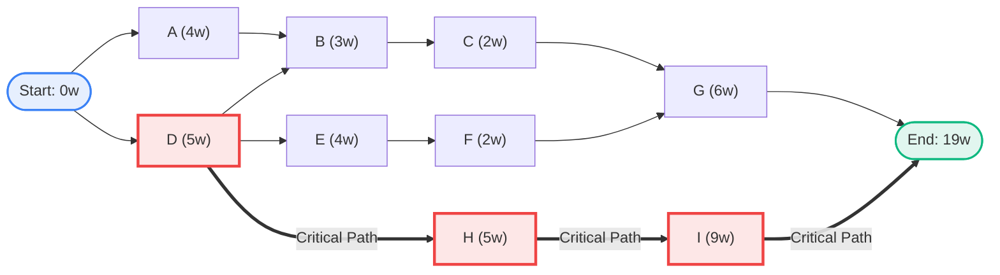
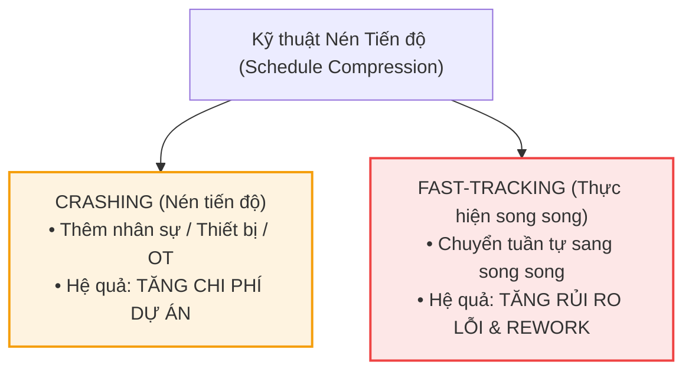

# TỔNG HỢP KIẾN THỨC PMG201c - BUỔI 2

---

## I. QUẢN LÝ CHI PHÍ & CÁC PHƯƠNG PHÁP ƯỚC LƯỢNG (COST BUDGET ITEMS & ESTIMATION METHODS)

### 1. 6 Loại chi phí phổ biến trong dự án (Main Cost Items)

1. **Labor Cost (Chi phí nhân sự / Nhân lực):** Chi phí trả cho đội ngũ thực hiện dự án (PM, BA, Developer, QA/Tester, hoặc đội Marketing, Content, KOLs...).
2. **Software & Tooling Licenses (Chi phí phần mềm & Công cụ):** Bản quyền công cụ làm việc, phần mềm chuyên dụng (GitHub, Jira, Figma, Cloud Server/Database, AI APIs, công cụ Marketing...).
3. **Materials, Equipment & Facilities (Chi phí vật tư, thiết bị & văn phòng phẩm):** Máy tính, ổ cứng lưu trữ/backup, thiết bị test, in ấn tài liệu đặc tả, văn phòng phẩm.
4. **Training Cost (Chi phí đào tạo):** Thuê chuyên gia hướng dẫn quy trình mới, đào tạo tích hợp công nghệ mới (AI, CI/CD, Framework mới...).
5. **Overhead / Operational Expenses (Chi phí vận hành chung):** Tiền điện, nước, internet, chi phí thuê không gian làm việc.
6. **Contingency Reserve (Chi phí dự phòng rủi ro):** Quỹ dự phòng ngân sách để ứng phó với các phát sinh đột xuất (thường trích 5% – 10% tổng ngân sách).

---

### 2. 5 Phương pháp ước lượng chi phí phổ biến (Estimation Methods)

| Phương pháp                                                   | Định nghĩa & Bản chất                                                                                                                                                                        | Áp dụng phù hợp nhất cho                                                   |
| :------------------------------------------------------------ | :------------------------------------------------------------------------------------------------------------------------------------------------------------------------------------------- | :------------------------------------------------------------------------- |
| **1. Bottom-up Estimation** _(Ước lượng từ dưới lên)_         | Chia nhỏ dự án thành từng task cụ thể, tính chi phí chi tiết từng task rồi cộng dồn lại: <br>$$\text{Chi phí} = \text{Số lượng nhân sự} \times \text{Số giờ làm} \times \text{Đơn giá/giờ}$$ | **Labor Cost** (Chi phí nhân sự theo giờ/tháng).                           |
| **2. Parametric Estimation** _(Ước lượng tham số)_            | Sử dụng mối quan hệ thống kê giữa dữ liệu lịch sử và biến số dự án: <br>$$\text{Chi phí} = \text{Đơn giá/đơn vị} \times \text{Số lượng}$$                                                    | **Software & Tooling Licenses** (Số license $\times$ giá/user), phần cứng. |
| **3. Analogous Estimation** _(Ước lượng tương tự / Top-down)_ | Dựa trên chi phí thực tế của các dự án tương tự đã thực hiện trong quá khứ (nhanh nhưng độ chính xác ở mức trung bình).                                                                      | **Materials & Equipment, Overhead** (Văn phòng phẩm, thiết bị chung).      |
| **4. Expert Judgment** _(Tham vấn chuyên gia)_                | Lấy ý kiến tư vấn từ các chuyên gia có kinh nghiệm hoặc báo giá từ đơn vị đào tạo bên ngoài.                                                                                                 | **Training Cost** (Đào tạo công nghệ mới, AI...).                          |
| **5. Reserve Analysis** _(Phân tích quỹ dự phòng)_            | Trích một tỷ lệ phần trăm cố định (5% - 10%) trên tổng chi phí dự toán của dự án.                                                                                                            | **Contingency Reserve** (Dự phòng rủi ro).                                 |

---

### 3. Khung chuẩn trình bày 1 Cost Item trong bài thi PE

> **Cấu trúc 1 mục chi phí đạt điểm tối đa:**
>
> 1. **Name:** Tên loại chi phí.
> 2. **Description:** Mô tả chi tiết (gồm nhân sự nào/công cụ gì, làm việc trong bao lâu).
> 3. **Estimation Method & Details:** Nêu rõ phương pháp ước lượng và công thức tính cụ thể.
> 4. **Estimated Cost:** Tổng số tiền đã tính toán.
> 5. **Person in Charge:** Người chịu trách nhiệm phê duyệt/chi trả (PM, HR, Finance Department...).

#### _Ví dụ mẫu 1 Cost Item (Labor Cost):_

- **Name:** Project Team Labor Cost
- **Description:** Chi phí nhân sự cho 1 Project Manager (PM), 3 Developers (Dev) và 1 QA Tester làm việc trong 4 tháng (dự án Student Learning Management).
- **Estimation Method:** Bottom-up Estimation
- _PM:_ $160\text{ hrs} \times \$30/\text{hr} = \$4,800$
- _Developers:_ $3\text{ devs} \times 400\text{ hrs} \times \$20/\text{hr} = \$24,000$
- _QA Tester:_ $160\text{ hrs} \times \$20/\text{hr} = \$3,200$
- **Estimated Cost:** $\$32,000$
- **Person in Charge:** Project Manager & HR Manager.

---

## II. SƠ ĐỒ MẠNG & PHƯƠNG PHÁP ĐƯỜNG GĂNG (NETWORK DIAGRAM & CRITICAL PATH METHOD - CPM)

### 1. Các khái niệm cốt lõi

- **Network Diagram (Sơ đồ mạng AON - Activity On Node):** Sơ đồ thể hiện trình tự logic và mối quan hệ phụ thuộc giữa các công việc trong dự án.
- **Critical Path (Đường găng):** Chuỗi các hoạt động liên tiếp từ Start đến End có **tổng thời lượng dài nhất**.
- **Minimum Project Duration (Thời gian tối thiểu hoàn thành dự án):** Bằng chính tổng thời lượng của Đường găng (_Critical Path Duration_).
- **Critical Activities:** Các hoạt động nằm trên đường găng. Nếu bất kỳ hoạt động nào trên đường găng bị chậm trễ, toàn bộ dự án sẽ bị trễ hạn.

---

### 2. Hướng dẫn vẽ và trình bày Sơ đồ mạng (AON)

#### Ví dụ bảng phụ thuộc công việc:

| Activity  | Preceding Activity | Duration (weeks) |
| :-------: | :----------------: | :--------------: |
| **Start** |         —          |        0         |
|   **A**   |       Start        |        4         |
|   **B**   |        A, D        |        3         |
|   **C**   |         B          |        2         |
|   **D**   |       Start        |        5         |
|   **E**   |         D          |        4         |
|   **F**   |         E          |        2         |
|   **G**   |        C, F        |        6         |
|   **H**   |         D          |        5         |
|   **I**   |         H          |        9         |
|  **End**  |        G, I        |        0         |

#### Sơ đồ mạng AON trực quan (Mermaid Diagram):



#### Cách vẽ nháp sơ đồ mạng:

```
 ┌── [ A (4) ] ───┐
 │
[ Start ] ─┼────────────── [ B (3) ] ── [ C (2) ] ──┐
 │
 └── [ D (5) ] ── [ E (4) ] ── [ F (2) ] ── [ G (6) ] ──┐
 │
 └────── [ H (5) ] ─────────── [ I (9) ] ─── [ End ]
```

#### Cách trình bày trên bài thi EOS (viết dạng Text):

Liệt kê tất cả các đường đi (Paths) từ Start đến End và tính tổng thời gian:

- **Path 1:** $\text{Start} \rightarrow \text{A} \rightarrow \text{B} \rightarrow \text{C} \rightarrow \text{G} \rightarrow \text{End} = 4 + 3 + 2 + 6 = \mathbf{15\text{ weeks}}$
- **Path 2:** $\text{Start} \rightarrow \text{D} \rightarrow \text{B} \rightarrow \text{C} \rightarrow \text{G} \rightarrow \text{End} = 5 + 3 + 2 + 6 = \mathbf{16\text{ weeks}}$
- **Path 3:** $\text{Start} \rightarrow \text{D} \rightarrow \text{E} \rightarrow \text{F} \rightarrow \text{G} \rightarrow \text{End} = 5 + 4 + 2 + 6 = \mathbf{17\text{ weeks}}$
- **Path 4:** $\text{Start} \rightarrow \text{D} \rightarrow \text{H} \rightarrow \text{I} \rightarrow \text{End} = 5 + 5 + 9 = \mathbf{19\text{ weeks}}$

$\Rightarrow$ **Critical Path:** $\text{Start} \rightarrow \text{D} \rightarrow \text{H} \rightarrow \text{I} \rightarrow \text{End}$
$\Rightarrow$ **Thời gian tối thiểu hoàn thành dự án (Minimum Project Duration):** $\mathbf{19\text{ tuần}}$.

---

## III. THUẬT TOÁN TÍNH ES, EF, LS, LF & FLOAT (TOTAL SLACK)

### 1. Ý nghĩa 4 chỉ số thời gian

- **ES (Early Start):** Thời điểm sớm nhất hoạt động có thể bắt đầu.
- **EF (Early Finish):** Thời điểm sớm nhất hoạt động có thể kết thúc.
- **LS (Late Start):** Thời điểm muộn nhất hoạt động có thể bắt đầu mà không làm chậm tiến độ chung.
- **LF (Late Finish):** Thời điểm muộn nhất hoạt động phải kết thúc mà không làm chậm tiến độ chung.
- **Float / Total Slack (Thời gian trôi / Độ trễ cho phép):** Khoảng thời gian một công việc có thể trì hoãn mà không ảnh hưởng đến ngày kết thúc dự án.

---

### 2. Công thức và Quy tắc tính toán

```
┌─────────────────────────┐
│ ES │ Duration │ EF │
├────────┼──────────┼─────┤
│ LS │ Float │ LF │
└─────────────────────────┘
```

#### A. Chiều xuôi (Forward Pass: Start $\rightarrow$ End) $\Rightarrow$ Tìm ES & EF:

- Hoạt động bắt đầu: $ES_{\text{Start}} = 0$.
- Công thức cơ bản:
  $$\mathbf{EF = ES + Duration}$$
- Đối với hoạt động có nhiều hoạt động liền trước (_Merge Node_):
  $$\mathbf{ES = \max(EF_{\text{tất cả các hoạt động liền trước}})}$$

#### B. Chiều ngược (Backward Pass: End $\rightarrow$ Start) $\Rightarrow$ Tìm LF & LS:

- Hoạt động kết thúc: $LF_{\text{End}} = \text{Tổng thời lượng Critical Path}$ (ở ví dụ trên là $19$).
- Công thức cơ bản:
  $$\mathbf{LS = LF - Duration}$$
- Đối với hoạt động có nhiều hoạt động liền sau (_Split Node khi đi lùi_):
  $$\mathbf{LF = \min(LS_{\text{tất cả các hoạt động liền sau}})}$$

#### C. Tính Float & Xác định tính linh hoạt (Flexibility):

$$\mathbf{Float = LS - ES = LF - EF}$$

- Nếu **$\text{Float} = 0$**: Hoạt động thuộc **Đường găng (Critical Activity)** — không có độ trễ linh hoạt.
- Nếu **$\text{Float} > 0$**: Hoạt động có **Độ linh hoạt (Flexibility)**. Hoạt động có $\text{Float}$ lớn nhất là hoạt động có **Most Flexibility**.

---

### 3. Bảng tổng hợp kết quả tính toán chi tiết

| Activity | Duration | ES  | EF  | LS  | LF  | Float ($LS - ES$) | Nhận xét              |
| :------: | :------: | :-: | :-: | :-: | :-: | :---------------: | :-------------------- |
|  **A**   |    4     |  0  |  4  |  4  |  8  |       **4**       | Có độ trễ 4 tuần      |
|  **B**   |    3     |  5  |  8  |  8  | 11  |       **3**       | Có độ trễ 3 tuần      |
|  **C**   |    2     |  8  | 10  | 11  | 13  |       **3**       | Có độ trễ 3 tuần      |
|  **D**   |    5     |  0  |  5  |  0  |  5  |       **0**       | **Critical Activity** |
|  **E**   |    4     |  5  |  9  |  7  | 11  |       **2**       | Có độ trễ 2 tuần      |
|  **F**   |    2     |  9  | 11  | 11  | 13  |       **2**       | Có độ trễ 2 tuần      |
|  **G**   |    6     | 11  | 17  | 13  | 19  |       **2**       | Có độ trễ 2 tuần      |
|  **H**   |    5     |  5  | 10  |  5  | 10  |       **0**       | **Critical Activity** |
|  **I**   |    9     | 10  | 19  | 10  | 19  |       **0**       | **Critical Activity** |

> **Cách ghi điểm thi câu hỏi Float/Flexibility trên EOS:**
>
> - Các hoạt động có tính linh hoạt cao nhất (_Most Flexibility_): **Activity A** (Float = 4 tuần), sau đó đến **B, C** (Float = 3 tuần).

---

## IV. CÁC KỸ THUẬT RÚT NGẮN TIẾN ĐỘ (SCHEDULE COMPRESSION)



Khi dự án bị chậm trễ hoặc cần đẩy sớm tiến độ, áp dụng 2 kỹ thuật chính trên **các hoạt động thuộc Đường găng (Critical Path)**:

```
 ┌─────────────────────────────────────────────────────────────┐
 │ SCHEDULE COMPRESSION TECHNIQUES │
 └──────────────┬──────────────────────────────┬───────────────┘
 │ │

 ┌──────────────────────────────┐ ┌──────────────────────────────┐
 │ CRASHING │ │ FAST-TRACKING │
 ├──────────────────────────────┤ ├──────────────────────────────┤
 │ • Thêm nhân sự / thiết bị │ │ • Thực hiện song song │
 │ • Tăng chi phí dự án │ │ • Tăng rủi ro lỗi / rework │
 └──────────────────────────────┘ └──────────────────────────────┘
```

1. **Crashing (Nén tiến độ / Gia tốc tiến độ):**

- _Bản chất:_ Bổ sung thêm nguồn lực (tuyển thêm Dev/Tester, làm thêm giờ/OT, mua thêm máy chủ mạnh hơn) để giảm thời gian thực hiện.
- _Hệ quả:_ **Tăng chi phí dự án**.

2. **Fast-tracking (Thực hiện song song / Đẩy nhanh tiến độ):**

- _Bản chất:_ Chuyển đổi các công việc vốn thực hiện tuần tự sang làm song song hoặc gối đầu nhau (ví dụ: vừa thiết kế UI/UX vừa tiến hành dựng Database).
- _Hệ quả:_ **Tăng rủi ro phát sinh lỗi hoặc phải làm lại (Rework)**.

---

### Ứng dụng giải bài toán: _Đề xuất giải pháp khắc phục khi Activity D bị chậm 3 tuần_

Để khắc phục 3 tuần bị trễ mà không làm tăng tổng thời gian dự án, ta phải rút ngắn 3 tuần trên các hoạt động thuộc đường găng nằm sau D (ở đây là đường $\text{D} \rightarrow \text{H} \rightarrow \text{I}$ hoặc các nhánh phụ $\text{E} \rightarrow \text{F}$):

- **Giải pháp 1 (Crashing Activity I):** Áp dụng Crashing cho **Activity I** (hoạt động có duration lớn nhất = 9 tuần) bằng cách bổ sung thêm 2 Lập trình viên cao cấp và 1 Tester để rút ngắn thời lượng từ 9 tuần xuống còn 6 tuần (tiết kiệm đúng 3 tuần).
- **Giải pháp 2 (Crashing Activity E & F):** Bổ sung thêm nhân sự phát triển cho Activity E (giảm 2 tuần) và tăng cường kiểm thử tự động cho Activity F (giảm 1 tuần), tổng cộng giảm 3 tuần.
- **Giải pháp 3 (Fast-tracking Activity H & I):** Cho phép triển khai sớm một số module độc lập của Activity I ngay khi Activity H hoàn thành được 50% (thực hiện gối đầu), giúp rút ngắn 3 tuần thời gian chờ.
- **Giải pháp 4 (Crashing Activity H & Fast-tracking):** Tăng cường làm ngoài giờ (Overtime) cho Activity H để giảm 1 tuần, kết hợp chia nhỏ các module của Activity I để làm song song giảm thêm 2 tuần.

---

## V. TỔNG KẾT & LƯU Ý ÔN THI PE

1. **Vẽ sơ đồ mạng ra giấy nháp thật chuẩn xác:** Xác định đủ tất cả các nhánh đường đi (Paths) $\rightarrow$ Tìm ra đường dài nhất làm Critical Path.
2. **Nắm vững quy tắc:**

- Chiều xuôi ($ES \rightarrow EF$): Lấy $\max$.
- Chiều ngược ($LF \rightarrow LS$): Lấy $\min$.
- $\text{Float} = LS - ES = LF - EF$.

3. **Mẹo làm bài thi EOS:** Không cần vẽ hình, chỉ cần trình bày text liệt kê các Path, độ dài Path, bảng ES/EF/LS/LF/Float và nêu giải pháp Crashing/Fast-tracking rõ ràng.
