# TỔNG HỢP KIẾN THỨC PMG201c - BUỔI 3

---

## BÀI TOÁN TỔNG THỂ (CASE STUDY CỐ ĐỊNH)

> **Dự án:** _University Library Digitalization Project_ (Số hóa thư viện trường đại học).
>
> - **Thời gian (DAC):** $12\text{ tháng}$ | **Ngân sách (BAC):** $\$500,000$.
> - **Yêu cầu cốt lõi:**
>
> 1. Số hóa và quét đồng thời $50,000$ cuốn sách và $100,000$ bài báo nghiên cứu (_Research papers_).
> 2. Xây dựng công cụ tìm kiếm nhanh (_Search Engine_).
> 3. Hệ thống xác thực và phân quyền người dùng (_User Authentication & Access Control_).
> 4. Đảm bảo bảo mật và sao lưu dữ liệu (_Data Security & Backup_).
>
> - **Các bên liên quan:** Trường Đại học (_University - Sponsor_), Công ty phần mềm (_IT Company_), Nhân viên thư viện (_Library Staff_), Sinh viên & Giảng viên (_End Users_).

---

## I. CẤU TRÚC PHÂN CHIA CÔNG VIỆC (WORK BREAKDOWN STRUCTURE - WBS)

### 1. Bản chất & Các cấp bậc trong WBS

- **WBS:** Cấu trúc phân rã thứ bậc của toàn bộ công việc dự án thành các phần nhỏ hơn, hướng đến sản phẩm/kết quả bàn giao (_Deliverables_).
- **Quy tắc phân cấp (Hierarchy Levels):**
- **Level 1 (Cấp 1):** Tên dự án tổng thể.
- **Level 2 (Cấp 2):** Các giai đoạn của dự án (_Project Phases / Lifecycle_).
- **Level 3 (Cấp 3):** Các gói công việc / Sản phẩm bàn giao con (_Work Packages / Sub-deliverables_).
- **Level 4 (Cấp 4):** Các hoạt động / Nhiệm vụ cụ thể (_Tasks / Activities_).

---

### 2. Khung WBS 5 giai đoạn chuẩn cho Dự án Phần mềm & Dữ liệu

```mermaid
flowchart TD
 L1["1.0 University Library Digitalization"]
 L1 --> L2_1["1.1 Initiation & Planning"]
 L1 --> L2_2["1.2 Data Digitization"]
 L1 --> L2_3["1.3 System Development"]
 L1 --> L2_4["1.4 Deployment & UAT"]
 L1 --> L2_5["1.5 Project Closing"]

 L2_1 --> L3_1["1.1.1 Project Charter"]
 L2_1 --> L3_2["1.1.2 Management Plan"]
 L2_2 --> L3_3["1.2.1 Categorization"]
 L2_2 --> L3_4["1.2.2 150k Scanning"]
 L2_2 --> L3_5["1.2.3 Data QA"]
 L2_3 --> L3_6["1.3.1 SRS Specs"]
 L2_3 --> L3_7["1.3.2 System & DB Design"]
 L2_3 --> L3_8["1.3.3 Core Modules Coding"]
 L2_3 --> L3_9["1.3.4 System Testing"]
 L2_4 --> L3_10["1.4.1 Server Setup"]
 L2_4 --> L3_11["1.4.2 User UAT"]
 L2_5 --> L3_12["1.5.1 Final Handover"]
 L2_5 --> L3_13["1.5.2 User Manual"]

 style L1 fill:#3b82f620,stroke:#3b82f6,stroke-width:2px
 style L2_1 fill:#8b5cf620,stroke:#8b5cf6
 style L2_2 fill:#10b98120,stroke:#10b981
 style L2_3 fill:#f59e0b20,stroke:#f59e0b
 style L2_4 fill:#06b6d420,stroke:#06b6d4
 style L2_5 fill:#64748b20,stroke:#64748b
```



```
[ 1. University Library Digitalization Project ]
├── 1.1 Khởi tạo & Lập kế hoạch (Project Initiation & Planning)
│ ├── 1.1.1 Lập Điều lệ dự án (Project Charter)
│ └── 1.1.2 Xây dựng Kế hoạch quản lý dự án (Project Management Plan)
│
├── 1.2 Chuẩn bị dữ liệu & Số hóa (Data Preparation & Digitization)
│ ├── 1.2.1 Phân loại tài liệu (Pre-processing: Sách, Giáo trình, Báo khoa học)
│ ├── 1.2.2 Quét và trích xuất dữ liệu (Processing: Quét 50k sách & 100k bài báo)
│ └── 1.2.3 Kiểm tra chất lượng và sửa lỗi (Post-processing: QA Data)
│
├── 1.3 Phát triển hệ thống (System Development)
│ ├── 1.3.1 Thu thập và phân tích yêu cầu (SRS)
│ ├── 1.3.2 Thiết kế hệ thống (UI/UX, System Architecture, Database)
│ ├── 1.3.3 Lập trình các module cốt lõi (Search Engine, Authentication, Backup)
│ └── 1.3.4 Kiểm thử hệ thống (Unit Test, Integration Test)
│
├── 1.4 Triển khai & Chấp nhận (Deployment & Acceptance)
│ ├── 1.4.1 Triển khai lên máy chủ Production (Deployment)
│ └── 1.4.2 Kiểm thử chấp nhận người dùng (User Acceptance Testing - UAT)
│
└── 1.5 Kết thúc dự án (Project Closing)
 ├── 1.5.1 Bàn giao hệ thống và cơ sở dữ liệu đã số hóa
 └── 1.5.2 Chuyển giao tài liệu hướng dẫn sử dụng (User Manual)
```

> **Cách trình bày WBS trên bài thi EOS:**
> Sử dụng đánh chỉ mục số dạng phân cấp:
>
> - `1.0` Library Digitalization Project
> - `1.1` Project Initiation & Planning $\rightarrow$ `1.1.1` Project Charter $\rightarrow$ `1.1.2` Management Plan
> - `1.2` Data Digitization $\rightarrow$ `1.2.1` Document Categorization $\rightarrow$ `1.2.2` Document Scanning $\rightarrow$ `1.2.3` Quality Check
> - `1.3` System Development $\rightarrow$ `1.3.1` UI/UX Design $\rightarrow$ `1.3.2` Core Module Coding $\rightarrow$ `1.3.3` System Testing
> - `1.4` Deployment $\rightarrow$ `1.4.1` Server Setup $\rightarrow$ `1.4.2` User Acceptance Testing
> - `1.5` Project Closing $\rightarrow$ `1.5.1` System Handover $\rightarrow$ `1.5.2` User Manual Delivery

---

## II. MỤC TIÊU DỰ ÁN THEO NGUYÊN TẮC SMART (SMART GOALS)

### 1. Ý nghĩa 5 tiêu chí SMART

- **S - Specific (Cụ thể):** Xác định rõ ràng mục tiêu cần làm là gì, không chung chung.
- **M - Measurable (Đo lường được):** Có số liệu/chỉ số định lượng cụ thể để đánh giá hoàn thành.
- **A - Achievable (Khả thi):** Nằm trong tầm với của nguồn lực công nghệ và nhân sự hiện có.
- **R - Relevant (Phù hợp / Thực tế):** Đóng góp trực tiếp vào mục tiêu chung của dự án/tổ chức.
- **T - Time-bound (Có thời hạn):** Xác định mốc thời gian hoàn thành rõ ràng (thường ngắn hơn thời hạn tổng của dự án).

---

### 2. Hai mục tiêu SMART mẫu từ Case Study

#### Mục tiêu 1: Hoàn thành Số hóa dữ liệu (Digitization Goal)

- **S (Specific):** Quét, nhận dạng ký tự và nhập liệu toàn bộ tài liệu vật lý của thư viện vào hệ thống lưu trữ điện tử.
- **M (Measurable):** Số hóa hoàn tất chính xác $50,000$ cuốn sách và $100,000$ bài báo nghiên cứu (tổng cộng $150,000$ tài liệu) với tỷ lệ lỗi dưới $1\%$.
- **A (Achievable):** Phân bổ đội ngũ nhân sự chuyên trách gồm 10 nhân viên quét tài liệu kết hợp máy quét công nghiệp chuyên dụng.
- **R (Relevant):** Đảm bảo kho dữ liệu số cốt lõi để phần mềm thư viện có nội dung phục vụ người dùng.
- **T (Time-bound):** Hoàn thành trong vòng **9 tháng** kể từ ngày khởi động dự án.

#### Mục tiêu 2: Tối ưu hiệu suất Công cụ tìm kiếm (Search Engine Goal)

- **S (Specific):** Xây dựng và tối ưu hóa công cụ tìm kiếm dữ liệu thư viện cho sinh viên và giảng viên.
- **M (Measurable):** Thời gian phản hồi kết quả tìm kiếm dưới **3 giây** ($\le 3\text{s}$) và đạt độ chính xác truy vấn trên **95%**.
- **A (Achievable):** Sử dụng công nghệ tìm kiếm hiện đại kết hợp đánh chỉ mục (_Indexing_) và tối ưu hóa Database.
- **R (Relevant):** Giúp sinh viên và giảng viên tra cứu tài liệu nhanh chóng, nâng cao trải nghiệm người dùng.
- **T (Time-bound):** Hoàn thành và kiểm thử xong vào **tháng thứ 10** của dự án.

---

## III. PHẠM VI DỰ ÁN (PROJECT SCOPE MANAGEMENT)

```
┌─────────────────────────────────────────────────────────────────────────────┐
│ PROJECT SCOPE BOUNDARY │
├─────────────────────────────────────────────┬───────────────────────────────┤
│ IN-SCOPE (Trong phạm vi) │ OUT-OF-SCOPE (Ngoài phạm vi)│
├─────────────────────────────────────────────┼───────────────────────────────┤
│ • Số hóa 50k sách & 100k bài báo │ • Phát triển ứng dụng Mobile │
│ • Xây dựng Search Engine tốc độ cao │ • Số hóa cổ vật / bảo tàng │
│ • Triển khai hệ thống xác thực người dùng │ • Dịch thuật nội dung sách │
│ • Thiết lập cơ chế bảo mật và sao lưu data │ • Cung cấp máy tính cá nhân │
└─────────────────────────────────────────────┴───────────────────────────────┘
```

### 1. In-scope (Hạng mục trong phạm vi)

_Gồm toàn bộ các tính năng và yêu cầu được đề bài chỉ định rõ:_

- Quét và số hóa $50,000$ cuốn sách và $100,000$ bài báo nghiên cứu.
- Phát triển công cụ tìm kiếm nội dung trực tuyến.
- Thiết lập hệ thống đăng nhập, phân quyền truy cập (_Authentication & Access Control_).
- Cài đặt giải pháp sao lưu (_Backup_) và bảo mật dữ liệu an toàn.

### 2. Out-of-scope (Hạng mục ngoài phạm vi)

_Những công việc không thuộc hợp đồng/yêu cầu, cần loại trừ để tránh phình to phạm vi (Scope Creep):_

- Phát triển ứng dụng di động riêng biệt (_Mobile App_ - chỉ tập trung Web Portal).
- Số hóa các tài liệu cổ vật/lịch sử đặc biệt không thuộc danh mục thư viện.
- Dịch thuật nội dung tài liệu sang các ngôn ngữ khác.
- Cung cấp phần cứng (máy tính, máy tính bảng) cho sinh viên/độc giả.

### 3. Project Deliverables (Sản phẩm bàn giao chính)

1. **Phần mềm:** Hệ thống Cổng thông tin Thư viện số (_Library Digitalization Web Portal_) hoàn chỉnh.
2. **Dữ liệu:** Cơ sở dữ liệu số hóa $150,000$ tài liệu đã được kiểm duyệt chất lượng.
3. **Tài liệu:** Sổ tay hướng dẫn sử dụng (_User Manual_) và tài liệu bàn giao kỹ thuật cho phòng IT nhà trường.

---

## IV. PHÂN TÍCH CÁC BÊN LIÊN QUAN (STAKEHOLDER ANALYSIS)

| Stakeholder                            | Vai trò trong dự án     | Quyền lực (Power) | Mức độ quan tâm (Interest) | Chiến lược quản lý (Strategy) | Kế hoạch hành động                                                                             |
| :------------------------------------- | :---------------------- | :---------------: | :------------------------: | :---------------------------: | :--------------------------------------------------------------------------------------------- |
| **Ban Giám hiệu (University)**         | Chủ đầu tư / Cấp vốn    |     **High**      |          **Low**           |      **Keep Satisfied**       | Gửi báo cáo tiến độ/chi phí định kỳ theo Milestone; không làm phiền chi tiết kỹ thuật vụn vặt. |
| **Đội ngũ IT (IT Company)**            | Đơn vị phát triển       | **High / Medium** |          **High**          |      **Manage Closely**       | Quản lý sát sao tiến độ, giải quyết kịp thời các rào cản công nghệ và bảo mật.                 |
| **Nhân viên Thư viện (Library Staff)** | Người cung cấp tài liệu |      **Low**      |          **High**          |  **Keep Informed / Consult**  | Phối hợp phân loại sách, đào tạo quy trình số hóa và tiếp nhận ý kiến nghiệp vụ.               |
| **Sinh viên & Giảng viên**             | Người dùng cuối         |      **Low**      |          **High**          |       **Keep Informed**       | Tổ chức đợt thử nghiệm hệ thống (UAT), truyền thông hướng dẫn sử dụng phần mềm.                |

---

## V. ÔN TẬP CRITICAL PATH METHOD (CPM) & LƯU Ý KHI LÀM BÀI

### 1. Thời gian tối thiểu hoàn thành dự án (_Minimum Project Duration_)

> **Nguyên tắc cốt lõi:** Luôn bằng thời lượng của **Đường găng dài nhất (Longest Path)**.
>
> - _Lý do:_ Dự án chỉ được coi là hoàn tất khi **toàn bộ các nhánh công việc** từ Start đến End đều đã hoàn thành. Nhánh ngắn dù xong trước vẫn phải chờ nhánh dài nhất kết thúc.

### 2. Thuật toán Forward & Backward Pass

- **Forward Pass ($ES \rightarrow EF$):** $ES_{\text{Start}} = 0$, $EF = ES + \text{Duration}$, với nút nhập (_Merge Node_): $ES = \max(EF_{\text{trước}})$.
- **Backward Pass ($LF \rightarrow LS$):** $LF_{\text{End}} = \text{Độ dài Critical Path}$, $LS = LF - \text{Duration}$, với nút rẽ (_Split Node khi lùi_): $LF = \min(LS_{\text{sau}})$.
- **Float (Total Slack):** $\text{Float} = LS - ES = LF - EF$. Công việc có $\text{Float} > 0$ là công việc có **Flexibility**; công việc có $\text{Float}$ lớn nhất là **Most Flexible Activity**.

---

## VI. PHÂN TÍCH GIÁ TRỊ THU ĐƯỢC NÂNG CAO (EVM CALCULATION)

### 1. Dữ kiện bài toán (Tại mốc đánh giá sau 5 tháng)

- **Tổng ngân sách phê duyệt (BAC):** $\$500,000$.
- **Tổng thời gian kế hoạch (DAC):** $12\text{ tháng}$.
- **Thời điểm đánh giá ($t$):** $5\text{ tháng}$.
- **Thực tế thực hiện:** Số hóa được $15,000$ cuốn sách (trên tổng số $50,000$ sách theo kế hoạch tổng).

---

### 2. Các bước tính toán chi tiết

#### Bước 1: Tính Giá trị Kế hoạch (Planned Value - PV)

Sau 5 tháng, theo kế hoạch dự án phải đạt tiến độ $5/12$ tổng khối lượng:
$$\mathbf{PV = \frac{5}{12} \times BAC = \frac{5}{12} \times 500,000 \approx \$208,333.33}$$

#### Bước 2: Tính Giá trị Thu được thực tế (Earned Value - EV)

Thực tế sau 5 tháng chỉ hoàn thành được $15,000 / 50,000 = 30\%$ khối lượng:
$$\mathbf{EV = 30\% \times BAC = 0.30 \times 500,000 = \$150,000}$$

#### Bước 3: Tính Chỉ số Hiệu suất Tiến độ (Schedule Performance Index - SPI)

$$\mathbf{SPI = \frac{EV}{PV} = \frac{150,000}{208,333.33} \approx 0.72}$$

---

### 3. Đánh giá & Đề xuất hành động khắc phục (_Corrective Actions_)

- **Đánh giá tiến độ:**
- Vì $\mathbf{SPI = 0.72 < 1.0} \Rightarrow$ Dự án đang **chậm tiến độ nghiêm trọng so với kế hoạch (_Behind Schedule_)** (chỉ đạt $72\%$ hiệu suất kỳ vọng).

- **Đề xuất 2 giải pháp khắc phục:**

1.  **Fast-tracking (Thực hiện song song):** Cho phép các tổ công tác quét tài liệu phân loại và tiến hành quét song song nhiều danh mục sách/bài báo độc lập cùng lúc thay vì quét tuần tự từng kho.
2.  **Crashing (Tăng cường nguồn lực):** Thuê thêm máy quét công nghiệp tốc độ cao và huy động nhân sự làm thêm ca/ngoài giờ (_Overtime_) để đẩy nhanh tốc độ số hóa bù vào khoảng thời gian chậm trễ.
