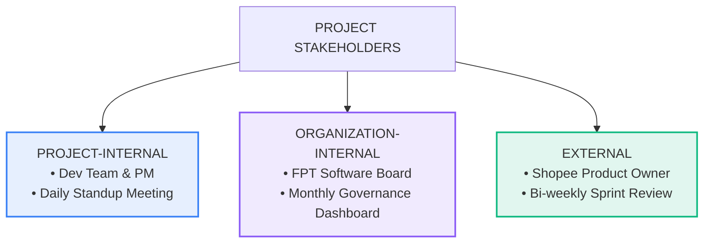

# TỔNG HỢP KIẾN THỨC PMG201c - BUỔI 4

---

## BỐI CẢNH DỰ ÁN MẪU (OPEN PROJECT SCENARIO)

> **Dự án:** _Shopee Next-Gen E-Commerce Web Platform_ (Nền tảng thương mại điện tử thế hệ mới).
>
> - **Bối cảnh:** Công ty Shopee đặt hàng FPT Software gia công phát triển nền tảng web mới thay thế hệ thống cũ.
> - **Thời gian:** 6 tháng | **Ngân sách:** $\$180,000$.

---

## I. REQUEST 1: PROJECT CHARTER (ĐIỀU LỆ DỰ ÁN - 20%)

### 1. Project Name (Tên dự án)

- **Quy tắc đặt tên chuẩn:** `[Tên thương hiệu] + [Lĩnh vực/Tính chất] + [Nền tảng]`
- **Ví dụ:** `Shopee Next-Gen E-Commerce Web Platform`

### 2. Project Purpose / Justification (Mục đích & Lý do thực hiện)

- **Vấn đề thực trạng:** Hệ thống website hiện tại đã lỗi thời (_outdated_), không xử lý được lưu lượng truy cập tăng đột biến trong các dịp siêu sale (_cannot handle high traffic spikes_), dẫn đến nghẽn mạng và thất thoát doanh thu.
- **Mục đích dự án:** Xây dựng nền tảng mới có khả năng mở rộng vượt trội (_High Scalability_), hiệu năng cao (_High Performance_), chịu tải được **1 triệu người dùng đồng thời (1M concurrent users)**, nâng cao trải nghiệm khách hàng và mục tiêu **tăng 20% doanh thu** trong năm đầu tiên ra mắt.

### 3. High-Level Requirements (Yêu cầu cấp cao - Liệt kê ít nhất 3 tính năng chính)

1. **Hệ thống Quản lý tài khoản & Bảo mật (Secure Authentication & Authorization):**

- Đăng ký/đăng nhập bảo mật cao, hỗ trợ đăng nhập một chạm qua bên thứ ba (**SSO** - Google, Facebook).
- Tích hợp xác thực 2 yếu tố (**2FA - Two-Factor Authentication**) để bảo vệ an toàn thông tin người dùng.

2. **Danh mục sản phẩm & Công cụ tìm kiếm thông minh (Product Catalog & AI Recommendation):**

- Cho phép tìm kiếm và bộ lọc nâng cao (_Advanced Filtering_) theo khoảng giá, danh mục, đánh giá (_Rating_).
- Tích hợp trí tuệ nhân tạo (**AI-Powered Recommendation**) để tự động gợi ý sản phẩm theo sở thích cá nhân của từng khách hàng.

3. **Quy trình Thanh toán Liền mạch (Seamless Checkout & Payment Integration):**

- Tích hợp đa cổng thanh toán (_Multiple Payment Gateways_): Thẻ tín dụng/ghi nợ, ví điện tử (ShopeePay, MoMo, VNPay), thanh toán khi nhận hàng (COD).
- Tối ưu hóa tốc độ xử lý giao dịch thanh toán trong **dưới 3 giây** ($\le 3\text{s}$).

---

## II. REQUEST 2: COST / BUDGET ITEMS (5 HẠNG MỤC CHI PHÍ - 20%)

| Tên chi phí (Cost Name)            | Mô tả chi tiết (Description)                                                                   | Phương pháp ước lượng (Method)                                                        | Chi phí ước tính | Người phụ trách (Person in Charge) |
| :--------------------------------- | :--------------------------------------------------------------------------------------------- | :------------------------------------------------------------------------------------ | :--------------: | :--------------------------------- |
| **1. Development Team Labor Cost** | Chi phí lương cho 1 PM, 1 Backend Dev, 2 Frontend Devs và 1 QA Tester trong 6 tháng.           | **Parametric / Bottom-up:** <br>$$\text{Tổng giờ} \times \text{Đơn giá/giờ}$$         |   $\$120,000$    | Project Manager & HR Manager       |
| **2. Cloud Infrastructure Cost**   | Thuê hạ tầng máy chủ, lưu trữ và cơ sở dữ liệu trên Cloud (AWS / Azure) phục vụ 6 tháng dự án. | **Analogous Estimation:** <br>Tham khảo chi phí các dự án E-commerce cùng quy mô.     |    $\$18,000$    | Lead DevOps Engineer               |
| **3. Software & Tooling Licenses** | Bản quyền công cụ phát triển (IntelliJ Ultimate, GitHub Enterprise, Jira, Figma).              | **Bottom-up / Parametric:** <br>$$\text{Đơn giá license} \times \text{Số lượng dev}$$ |    $\$5,000$     | IT Admin / Project Manager         |
| **4. UI/UX Design Outsourcing**    | Thuê ngoài đơn vị thiết kế chuyên nghiệp xây dựng bộ Design System và prototype hoàn chỉnh.    | **Vendor Bid Analysis:** <br>Đánh giá và chọn lọc từ báo giá của 3 agency thiết kế.   |    $\$15,000$    | Project Manager & Procurement      |
| **5. Contingency Reserve**         | Quỹ dự phòng rủi ro cho các phát sinh mở rộng phạm vi (_Scope Creep_) hoặc chậm trễ tiến độ.   | **Reserve Analysis:** <br>Trích cố định $10\%$ tổng ngân sách dự án.                  |    $\$18,000$    | Project Sponsor / PM               |

---

## III. REQUEST 3: COMMUNICATION PLAN (KẾ HOẠCH GIAO TIẾP - 30%)



```
 ┌─────────────────────────────────────────────────────────────┐
 │ PROJECT STAKEHOLDERS │
 └──────────────┬──────────────┬───────────────┬───────────────┘
 │ │ │

 ┌────────────────┐ ┌────────────────┐ ┌────────────────┐
 │PROJECT-INTERNAL│ │ ORG-INTERNAL │ │ EXTERNAL │
 ├────────────────┤ ├────────────────┤ ├────────────────┤
 │• Dev Team & PM │ │• FPT Software │ │• Shopee Client │
 │• Daily Standup │ │• Steering Comm.│ │• Sprint Review │
 └────────────────┘ └────────────────┘ └────────────────┘
```

### Bảng kế hoạch giao tiếp chi tiết:

| Nhóm Stakeholder          | Stakeholder cụ thể                              | Thông tin trao đổi (Information)                                              | Mục đích (Purpose)                                                           |      Tần suất (Frequency)      | Phương thức / Định dạng (Format)                                      | Người phụ trách (Responsible) |
| :------------------------ | :---------------------------------------------- | :---------------------------------------------------------------------------- | :--------------------------------------------------------------------------- | :----------------------------: | :-------------------------------------------------------------------- | :---------------------------- |
| **Project-Internal**      | **Đội ngũ dự án (Dev Team & QA)**               | Báo cáo tiến độ task hàng ngày, các vướng mắc kỹ thuật (_Blockers_).          | Đồng bộ công việc, tháo gỡ rào cản kỹ thuật ngay lập tức.                    |    **Hàng ngày** _(Daily)_     | **Daily Standup Meeting** (Họp nhanh 15 phút trực tiếp / Teams).      | Project Manager (PM)          |
| **Organization-Internal** | **Ban Giám đốc (FPT Software Management)**      | Báo cáo sức khỏe dự án (_Project Health_), ngân sách đã dùng, rủi ro nhân sự. | Đảm bảo dự án đi đúng định hướng công ty; đề xuất bổ sung nguồn lực nếu cần. |   **Hàng tháng** _(Monthly)_   | **Steering Committee Meeting** (Báo cáo Dashboard quản trị).          | Project Manager (PM)          |
| **External**              | **Khách hàng (Shopee Product Owner / Sponsor)** | Demo các tính năng đã hoàn thiện của Sprint, cập nhật tiến độ tổng thể.       | Khách hàng nghiệm thu tính năng, nhận phản hồi (_Feedback_) để điều chỉnh.   | **2 tuần / lần** _(Bi-weekly)_ | **Sprint Review / Demo Meeting** (Họp trực tuyến & Báo cáo biên bản). | PM & Business Analyst         |

---

## IV. REQUEST 4: PROJECT MILESTONES & ACTIVITIES SEQUENCE (30%)

### 1. 3 Cột mốc chính của dự án (Main Project Milestones)

- **Milestone 1:** Hoàn thành phê duyệt Thiết kế Hệ thống & UI/UX (_System Architecture & UI/UX Sign-off_).
- **Milestone 2:** Hoàn thành Phát triển các tính năng cốt lõi (_Core Feature Development Complete_).
- **Milestone 3:** Kiểm thử Chấp nhận Người dùng thành công và Triển khai Golive (_UAT Passed & System Go-Live_).

---

### 2. Chi tiết 10 Hoạt động và Mối quan hệ logic cho Milestone 2 (_Core Feature Development_)

|   ID    | Tên công việc (Activity Name)                                  | Thời lượng | Tiền nhiệm (Predecessor) |                      Loại quan hệ                       |
| :-----: | :------------------------------------------------------------- | :--------: | :----------------------: | :-----------------------------------------------------: |
| **A1**  | Thiết lập môi trường phát triển & CI/CD Pipeline               |   3 ngày   |            —             |                          Start                          |
| **A2**  | Xây dựng Schema Database & Migration Scripts                   |   4 ngày   |            A1            |               **FS** (A1 xong mới làm A2)               |
| **A3**  | Phát triển API Đăng ký / Đăng nhập & Xác thực 2FA              |   6 ngày   |            A2            |                         **FS**                          |
| **A4**  | Thiết kế và tích hợp giao diện (Frontend) Đăng nhập            |   5 ngày   |            A3            |    **SS** (Làm song song sau khi A3 bắt đầu 2 ngày)     |
| **A5**  | Phát triển module Quản lý Danh mục & Sản phẩm (Backend)        |   7 ngày   |            A2            |                         **FS**                          |
| **A6**  | Tích hợp thuật toán AI gợi ý sản phẩm (AI Engine)              |   8 ngày   |            A5            | **SS** (Chạy song song khi backend sản phẩm có dữ liệu) |
| **A7**  | Xây dựng module Giỏ hàng & Checkout API                        |   6 ngày   |            A5            |                         **FS**                          |
| **A8**  | Tích hợp Cổng thanh toán trực tuyến (Payment Gateway)          |   5 ngày   |            A7            |                         **FS**                          |
| **A9**  | Lập trình giao diện Giỏ hàng & Thanh toán (Frontend Checkout)  |   6 ngày   |          A7, A8          |          **FF** (Hoàn thành đồng thời với A8)           |
| **A10** | Thực hiện Kiểm thử đơn vị & Tích hợp (Unit & Integration Test) |   5 ngày   |        A3, A6, A9        |                         **FS**                          |

---

## V. CHỮA BÀI TẬP TRỌNG ĐIỂM: CRITICAL PATH METHOD (CPM)

### 1. Bảng dữ liệu sơ đồ mạng

| Activity  | Predecessor | Duration (weeks) |
| :-------: | :---------: | :--------------: |
| **Start** |      —      |        0         |
|   **A**   |    Start    |        4         |
|   **B**   |    A, D     |        3         |
|   **C**   |      B      |        2         |
|   **D**   |    Start    |        5         |
|   **E**   |      D      |        4         |
|   **F**   |      E      |        2         |
|   **G**   |    C, F     |        6         |
|   **H**   |      D      |        5         |
|   **I**   |      H      |        9         |
|  **End**  |    G, I     |        0         |

### 2. Các đường đi và Xác định Đường găng (Critical Path)

- **Path 1:** $\text{Start} \rightarrow \text{A} \rightarrow \text{B} \rightarrow \text{C} \rightarrow \text{G} \rightarrow \text{End} = 4 + 3 + 2 + 6 = \mathbf{15\text{ tuần}}$
- **Path 2:** $\text{Start} \rightarrow \text{D} \rightarrow \text{B} \rightarrow \text{C} \rightarrow \text{G} \rightarrow \text{End} = 5 + 3 + 2 + 6 = \mathbf{16\text{ tuần}}$
- **Path 3:** $\text{Start} \rightarrow \text{D} \rightarrow \text{E} \rightarrow \text{F} \rightarrow \text{G} \rightarrow \text{End} = 5 + 4 + 2 + 6 = \mathbf{17\text{ tuần}}$
- **Path 4:** $\text{Start} \rightarrow \text{D} \rightarrow \text{H} \rightarrow \text{I} \rightarrow \text{End} = 5 + 5 + 9 = \mathbf{19\text{ tuần}}$

$\Rightarrow$ **Critical Path:** $\text{Start} \rightarrow \text{D} \rightarrow \text{H} \rightarrow \text{I} \rightarrow \text{End}$
$\Rightarrow$ **Thời gian tối thiểu hoàn thành dự án (_Minimum Project Duration_):** $\mathbf{19\text{ tuần}}$.

---

### 3. Bảng tính chi tiết ES, EF, LS, LF & Float

| Activity | Duration | ES  | EF  | LS  | LF  | Float ($LS - ES$) | Tính linh hoạt (_Flexibility_)              |
| :------: | :------: | :-: | :-: | :-: | :-: | :---------------: | :------------------------------------------ |
|  **A**   |    4     |  0  |  4  |  4  |  8  |       **4**       | **Most Flexibility** (Độ trễ tối đa 4 tuần) |
|  **B**   |    3     |  5  |  8  |  8  | 11  |       **3**       | Có độ linh hoạt 3 tuần                      |
|  **C**   |    2     |  8  | 10  | 11  | 13  |       **3**       | Có độ linh hoạt 3 tuần                      |
|  **D**   |    5     |  0  |  5  |  0  |  5  |       **0**       | **Critical Activity** (Không được phép trễ) |
|  **E**   |    4     |  5  |  9  |  7  | 11  |       **2**       | Có độ linh hoạt 2 tuần                      |
|  **F**   |    2     |  9  | 11  | 11  | 13  |       **2**       | Có độ linh hoạt 2 tuần                      |
|  **G**   |    6     | 11  | 17  | 13  | 19  |       **2**       | Có độ linh hoạt 2 tuần                      |
|  **H**   |    5     |  5  | 10  |  5  | 10  |       **0**       | **Critical Activity** (Không được phép trễ) |
|  **I**   |    9     | 10  | 19  | 10  | 19  |       **0**       | **Critical Activity** (Không được phép trễ) |

> **Quy tắc làm bài thi:**
>
> - $ES_{\text{Start}} = 0$, $EF = ES + \text{Duration}$, $ES_{\text{node sau}} = \max(EF_{\text{các node trước}})$.
> - $LF_{\text{End}} = 19$, $LS = LF - \text{Duration}$, $LF_{\text{node trước}} = \min(LS_{\text{các node sau}})$.
> - Hoạt động có **Most Flexibility**: **Activity A** ($\text{Float} = 4$).

---

### 4. Đề xuất 4 Giải pháp rút ngắn 3 tuần chậm trễ cho nhánh Activity D

1. **Crashing Activity I:** Bổ sung thêm 2 Senior Developers vào Activity I (thời lượng gốc 9 tuần) để hoàn thành sớm trong 6 tuần, tiết kiệm đúng 3 tuần cho đường găng.
2. **Fast-tracking Activity H & I:** Cho phép Activity I khởi động sớm ngay khi Activity H đạt $60\%$ khối lượng (thực hiện gối đầu), rút ngắn 3 tuần thời gian chờ.
3. **Crashing Activity E & F (Nhánh phụ D-E-F-G):** Tăng cường kiểm thử tự động để giảm 2 tuần ở Activity E và 1 tuần ở Activity F để đảm bảo nhánh phụ không biến thành đường găng mới khi nhánh chính được rút ngắn.
4. **De-scoping (Giảm phạm vi tính năng kèm giả định - _Assumption_):**

- _Giả định:_ Khách hàng Shopee phê duyệt việc lược bỏ một số tiêu chí phức tạp không bắt buộc trong Activity H để bàn giao đúng hạn.
- _Hành động:_ Giảm bớt các yêu cầu phụ tại Activity H, giúp rút ngắn thời lượng hoàn thành từ 5 tuần xuống 2 tuần (tiết kiệm 3 tuần).
